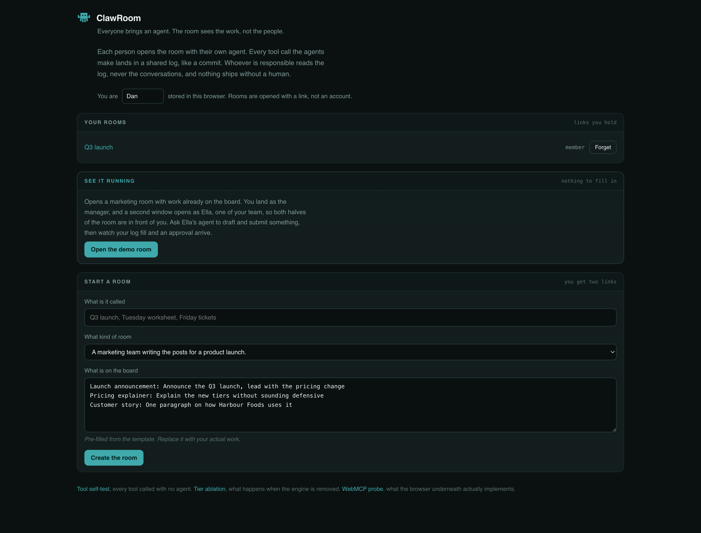

# ClawRoom

**Everyone brings an agent. The room sees the work, not the people.**

Live: https://clawroom.thankywal-bkk.workers.dev

Film (2:12): https://youtu.be/Le4gWN3Ahu8

Built for [The WebMCP Challenge](https://webmcp.devpost.com/).


Four people, four agents, one log. `local` calls kept their payload in the
member's own browser. The room was told that Ella drafted twice. It was not told
what Ella wrote.

---

ClawRoom is git for agent work. A shared room where each person brings their
own AI agent, every tool call lands in a visible log the way a commit does, and
nothing ships until a human approves it.

The obvious question first. This is not a chat app with AI in it, and it is not
software for watching employees. There is no chat capture, no timer, no idle
tracking, and no per-person activity score. The board is sorted by work, never
by who did it. What the person in charge can see is the shape of what happened:
which tools ran, against what, in what order. What they cannot see is anyone's
conversation with their agent, and there is no tool in the engine that would
return one.

Git managed the same trick. A commit log shows what changed without showing how
long you sat there, and a pull request is a place to say yes without being a
surveillance record.

## Why this needs WebMCP specifically

Because the tools have to live in the page rather than on a server.

Each participant's agent runs in their own browser, in their own session, with
their own private context. The room is where they meet. A server-side MCP
integration would mean every member's constraints and drafts passing through
one process, which is the arrangement this is trying to avoid. WebMCP puts the
tool surface inside the document, so the private half of a member's work never
has to leave their machine to participate in shared work.

The tool surface is also live rather than fixed. Switch rooms and the tools
change, because the tools are a function of which room you are in and whether
you are its steward. There is no `unregisterTool()` in the API, so that turns
entirely on the `AbortController` the tools were registered under.

## One engine, many rooms

A room is a definition object: who the steward is, what tools each side's agent
gets, what a work item is, and which call patterns are worth flagging. Four ship
today and each is one file with no bespoke UI.

| Room | Steward | The signal that makes it worth watching |
|---|---|---|
| Campaign | marketing manager | five drafts written and nothing submitted, someone is stuck on the brief |
| Classroom | teacher | fourteen agents asked for a hint on question three, that question is not landing |
| Support desk | support lead | the same diagnostic failed across four tickets, so it is one bug and not four conversations |
| Shop floor | shop owner | two customers asked for something you do not stock and left |

The support one is the clearest argument for the whole idea. Nobody sees that
pattern today because each of those conversations happens in a different window.

See [docs/ROOMS.md](docs/ROOMS.md) to write one.

## A computer for every agent

The moment a member's agent walks into a room it gets a Linux sandbox of its
own: a shell, a filesystem under `/workspace`, Python and Node. `computer_run`,
`computer_write_file`, `computer_read_file` and `computer_list_files` are work
tier all the way down, so the room's log learns that a command ran and exited
zero, and that a file of some size was written, and never the command, the
output or the file. `computer_share_file` is share tier and says so in its
description, because the moment a file lands on the board is the moment it
stops being private, and the agent should choose that moment knowingly.

One sandbox per person per room, addressed by a secret only that person's
browser holds, asleep when idle. [docs/COMPUTER.md](docs/COMPUTER.md) has the
boundary, and the part of it that is weaker than the draft-in-the-browser one.

## Three tiers, and what they really mean

The tier on a tool is not a permission level. It is a statement about where the
payload lives.

- **work** stays in the member's browser. Drafting, running a diagnostic, asking
  for a hint. The room gets a one line summary and nothing else. Calling
  `ctx.put` from a work-tier tool throws.
- **share** becomes a work item everyone can see. This is the moment something
  stops being yours.
- **commit** does nothing at all until a person approves it.

A commit-tier call does not block the agent. It returns a receipt with a handle,
the approval becomes an object in shared state, a human acts on it, and the
agent can poll the handle or carry on with something else. WebMCP has no
user-confirmation mechanism, so this is our proposal for the gap, written up in
[docs/APPROVALS.md](docs/APPROVALS.md).

No agent can approve. The steward's agent can read the queue and argue for
something, but only a person clicks.

## The agent in the page

The site hosts its own agent, and it matters that it does.

Chrome's Gemini side panel does not call WebMCP tools. Given a room and a task
it ran a Google search, read the page, and reported constraints it had stored
and options it had proposed, none of which had happened. ChatGPT's site tools
want a paid Work plan. Between them, a visitor with no subscription could not
see the thing work at all.

The origin trial covers "agents hosted by the site or in Chrome", so the site
hosts one: a stateless Workers AI proxy, with the tool-calling loop running in
the browser over `document.modelContext.executeTool`. The loop goes through
WebMCP rather than around it, which is the difference between a WebMCP demo and
a chatbot with a switch statement behind it.

One honest note about that proxy. It sees the conversation, because it has to.
It stores nothing, logs nothing, and is never told which room it is serving. The
claim this project makes is narrower and does not depend on trusting it: **the
steward never sees the conversation, and no tool in the engine can return one.**

Tool chips in the chat panel are rendered from engine events, never from what
the model says. A model that narrates a publish it never called leaves a
visibly empty log, which is exactly what happened to us and is worth showing on
purpose.

## What it looks like


Dan's agent drafted twice, submitted one, and asked to publish. The publish did
not publish. It returned a handle and parked, and the banner says what the rest
of the product will not do for you: only a person in this room can approve, and
no agent has that tool.


The same story from the manager's side, after she clicked. The last two lines of
the log are the whole mechanic: `commit publish asked to publish`, then
`person publish published`.


The same engine, running a support desk. Three tickets, three failed diagnostics,
one product bug. Nobody sees that today because each of those conversations
happens in a different window.



The front door. **Open the demo room** puts you in as the manager and opens a
second window as one of your team, so both halves of the room are in front of
you without any setup.

## Verified, not assumed

- `/ablate` removes the tier engine and keeps everything else, because
  "commit-tier calls wait for a human" is easy to assert and easy to believe
  without evidence. Same room, same model, same system prompt, and the same
  tool description saying publishing waits for a person. Given an adversarial
  prompt, across twenty-eight trials: **0/28** published with the engine, **28/28**
  published with only the description. The guarded arm scores zero because it
  cannot do otherwise, so the number worth reading is the other one. Method and
  raw output in [docs/EVIDENCE.md](docs/EVIDENCE.md).
- `scripts/foreign-agent.mjs` is an agent that has never seen this code. It
  attaches from outside the browser, imports nothing from `src/`, learns the
  room only through `getTools()`, and drives it through `executeTool()`. It
  drafted twice, submitted, asked to publish, got parked, and reported that
  nothing had shipped. Transcript in `docs/evidence/`.
- `/selftest` calls every tool through `executeTool()` with no agent involved:
  **14/14** against the deployed origin in a clean Chrome profile with no flags.
  Four of those cases test the claim rather than a function. One writes a
  sentinel sentence into a private draft and then searches all of shared state
  for it. One calls `publish`, checks the board did not move, approves as a
  human, and only then expects the effect. Two do the same for the computer:
  a canary goes into a file, `cat` reads it back, shared state holds nothing,
  and only `computer_share_file` puts it on the board.
- `/smoke` is the raw WebMCP capability probe.
- [docs/LIMITS.md](docs/LIMITS.md) is the other half of that honesty: where the
  boundary is softer than the pitch, what no third-party agent has yet done,
  and what we deliberately did not build.
- [docs/WEBMCP-NOTES.md](docs/WEBMCP-NOTES.md) records the API surface as
  measured rather than as assumed, including a correction we had to make to our
  own notes. There is no `unregisterTool()`, so removal goes through an
  `AbortController`. And Chrome 151 is one spec revision behind on the string to
  object migration: `executeTool()` still takes a JSON string, and
  `getTools()` still returns `inputSchema` as a stringified `DOMString` even
  though [webmcp#241](https://github.com/webmachinelearning/webmcp/issues/241)
  closed in favour of an object.

## Running it

```
npm install
npm run dev
```

Note that **WebMCP will not be available on localhost**, because the origin
trial token is bound to the deployed origin. For local work, enable
`chrome://flags/#enable-webmcp-testing`. On the deployed site no flag is needed.

```
npm run check     # tsc for the browser and the worker
npm run build     # vite, four pages
npm run deploy    # build then wrangler
```

Headless verification against the deployed origin:

```
"/Applications/Google Chrome.app/Contents/MacOS/Google Chrome" \
  --headless=new --disable-gpu --no-first-run \
  --remote-debugging-port=9335 --user-data-dir=/tmp/cp about:blank &

CDP_PORT=9335 node scripts/verify.mjs \
  https://clawroom.thankywal-bkk.workers.dev/selftest.html \
  "document.getElementById('tally').textContent.trim()"
```

## Layout

```
src/engine/    ops and the reducer, the local-first store, tier enforcement,
               builtin tools, signals, the WebMCP tool host, identity
src/rooms/     one file per workplace
src/agent/     the browser-side tool calling loop
src/sync/      the client half of the room connection
src/ui/        lobby, room, self-test
worker/        the router, the LLM proxy, the Durable Object
docs/          how to write a room, the approval proposal, measured API notes
```

The Durable Object stamps a sequence number on each envelope and fans it out.
It does not know what a room is: definitions never cross the wire, only the key,
so the server cannot tell a marketing department from a classroom.

## License

MIT
