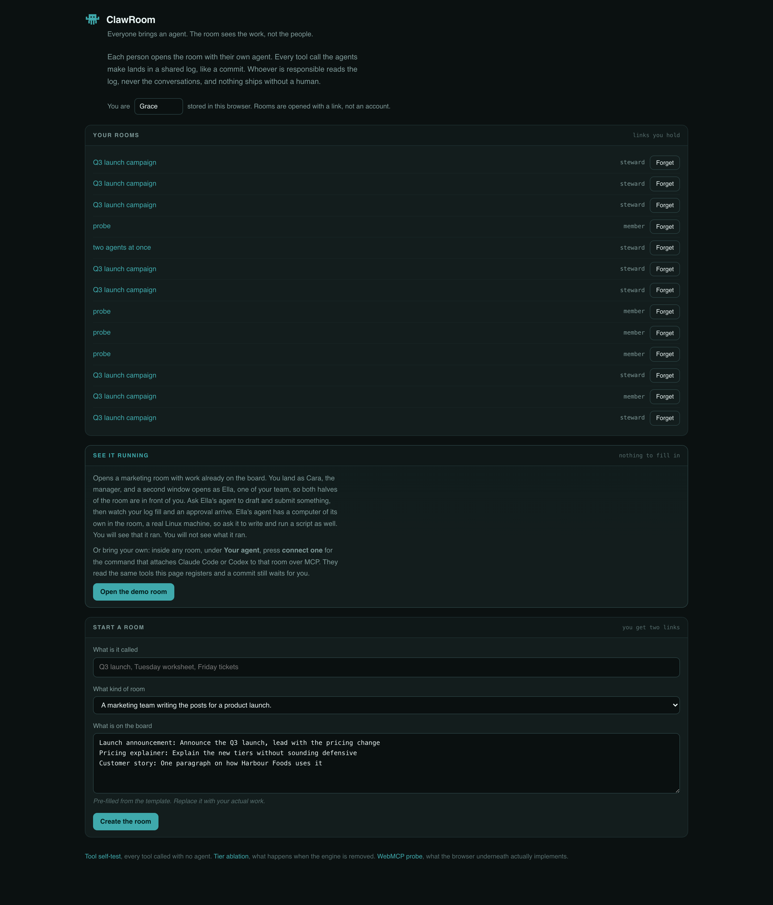

# ClawRoom

**Everyone brings an agent. The room sees the work, not the people.**

Live: https://clawroom.thankywal-bkk.workers.dev

Film (2:53): https://youtu.be/c9gOER5Djeo

Built for [The WebMCP Challenge](https://webmcp.devpost.com/).


Four people, four agents, one log. `local` calls kept their payload in the
member's own browser. The room was told that Ella drafted twice. It was not told
what Ella wrote.

Any of those agents can be yours: Claude Code and Codex have both joined a room
through `scripts/clawroom-mcp.mjs`, drafted privately, asked to publish, and
been parked by the same approval a person clicks. Inside any room, under
**Your agent**, press **connect one** for the command.

---

ClawRoom is git for agent work. A shared room where each person brings their
own AI agent, every tool call lands in a visible log the way a commit does, and
nothing ships until a human approves it.

The obvious question first. This is not a chat app with AI in it, and it is not
software for watching employees. There is no chat capture, no timer, no idle
tracking, and no per-person activity score. The board is sorted by work, never
by who did it. What the person in charge can see is the shape of what happened:
which tools ran, against what, in what order. What they cannot see is anyone's
conversation with their agent, and there is no tool in the engine that would
return one.

Git managed the same trick. A commit log shows what changed without showing how
long you sat there, and a pull request is a place to say yes without being a
surveillance record.

## The smaller case, which is the one that is true today

A room is for a team, and a team where everybody brings an agent is a near
future rather than a present one. The version of this that is true on an
ordinary Tuesday is smaller: **one person running more than one agent at once.**

Anybody with Claude Code and Codex both installed already does it, and already
has the problem. Two terminals, two histories, no shared record, and the only
thing stopping either of them from doing something irreversible is that you
happen to be watching.

ClawRoom gives each one a seat with its own name, its own computer, and one log
you read. It is the same product, not a different mode:

```
claude mcp add clawroom -- node scripts/clawroom-mcp.mjs "<member link>&as=Claude"
codex  mcp add clawroom -- node scripts/clawroom-mcp.mjs "<member link>&as=Codex"
```

Both commands are printed for you inside any room, under **Your agent**, with
that room's link already in them.

Run both at once and the room keeps them apart. Measured, and read out of a
third window neither agent could write to:

```
Claude  local   list_posts       read the board, 3 posts
Codex   local   list_posts       read the board, 3 posts
Claude  commit  publish          asked to publish "Launch announcement" to blog
Codex   commit  publish          asked to publish "Launch announcement" to blog
Claude  local   check_approval   checked apv_ir7e
Codex   local   check_approval   checked apv_d6hq
```

The lines interleave, because both were working in the same second. The names
are right because the server stamps the sender from the socket rather than
believing the envelope. Two agents asked to publish the same item and got two
separate handles, and neither shipped. The full run is in
[docs/evidence/two-agents-one-room-2026-08-31.md](docs/evidence/two-agents-one-room-2026-08-31.md).

`--away "<task>"` is the same thing on a machine you are not watching. An agent
can work all night. It cannot ship anything all night. You wake up to a queue of
decisions.

## Why this needs WebMCP specifically

Because the tools have to live in the page rather than on a server.

Each participant's agent runs in their own browser, in their own session, with
their own private context. The room is where they meet. A server-side MCP
integration would mean every member's constraints and drafts passing through
one process, which is the arrangement this is trying to avoid. WebMCP puts the
tool surface inside the document, so the private half of a member's work never
has to leave their machine to participate in shared work.

The tool surface is also live rather than fixed. Switch rooms and the tools
change, because the tools are a function of which room you are in and whether
you are its steward. There is no `unregisterTool()` in the API, so that turns
entirely on the `AbortController` the tools were registered under, one per
tool, and `mount()` diffs the surface rather than rebuilding it. The self test
asserts that as a delta and not a total: approving a source takes
`document.modelContext` from 21 tools to 25, names the four that arrived, and
requires that none of the other 21 went away in between.

## One engine, many rooms

A room is a definition object: who the steward is, what tools each side's agent
gets, what a work item is, and which call patterns are worth flagging. Five ship
today and each is one file with no bespoke UI; the fifth was generated from an
OpenAPI document.

| Room | Steward | The signal that makes it worth watching |
|---|---|---|
| Campaign | marketing manager | five drafts written and nothing submitted, someone is stuck on the brief |
| Classroom | teacher | fourteen agents asked for a hint on question three, that question is not landing |
| Support desk | support lead | the same diagnostic failed across four tickets, so it is one bug and not four conversations |
| Shop floor | shop owner | two customers asked for something you do not stock and left |
| Order desk | desk lead | one agent has called the same tool four times running, something is not working for them |

The support one is the clearest argument for the whole idea. Nobody sees that
pattern today because each of those conversations happens in a different window.

See [docs/ROOMS.md](docs/ROOMS.md) to write one.

## A computer for every agent

The moment a member's agent walks into a room it gets a Linux sandbox of its
own: a shell, a filesystem under `/workspace`, Python and Node. `computer_run`,
`computer_write_file`, `computer_read_file` and `computer_list_files` are work
tier all the way down, so the room's log learns that a command ran and exited
zero, and that a file of some size was written, and never the command, the
output or the file. `computer_share_file` is share tier and says so in its
description, because the moment a file lands on the board is the moment it
stops being private, and the agent should choose that moment knowingly.

The machine is a real one. `computer_serve` keeps a program running in the
background and waits for its port, `computer_fetch_local` reads what it
serves, and `computer_share_page` puts that page on the board, which is the
one moment it stops being private. `computer_browse` opens a public URL in a
real browser and returns the text, marked untrusted. `computer_snapshot` and
`computer_restore` keep tarballs of the workspace inside the sandbox. And a
console under "On this machine" lets the person type into the same computer
through the same `computer_run` tool, so a person and their agent share one
machine and one log.

The steward gets none of that, because the steward never does the work. They
get counts per member, a signal when someone has failed three commands in a
row, a button that rotates the invite link and one that deletes the room.

One sandbox per person per room, addressed by a secret only that person's
browser holds, asleep when idle. [docs/COMPUTER.md](docs/COMPUTER.md) has the
boundary, and the part of it that is weaker than the draft-in-the-browser one.

## Tools the room borrowed

A room's own tools ship with the site. A **source** is the second way in: point
the room at an OpenAPI document or a remote MCP server and its operations
become tools for everyone in the room, tiered by the same three rules. Reads
are work, writes are share, and anything that sounds irreversible is commit and
waits for a person.

What makes it safe to offer is that `add_tool_source` is itself commit tier. An
agent can propose a source; nothing registers. A person approves, the op
reaches every browser in the room, every browser remounts, and
`document.modelContext` changes for all of them at the same instant. That is
what the API's live surface is for.

Try it on the fixture the site serves, which has a refund in it:

    https://clawroom.thankywal-bkk.workers.dev/api/demo/openapi.json

or on a real third-party MCP server that needs no key:

    https://mcp.deepwiki.com/mcp

[docs/SOURCES.md](docs/SOURCES.md) has the tier rules, the address guard, and
why a page that registers its own WebMCP tools can be seen but not called.

## Bring your own agent, over MCP

A coding agent that speaks MCP can join a room:

```
npm run room     # makes a room, prints both links and the command to paste
```

```
claude mcp add clawroom -- node scripts/clawroom-mcp.mjs "<member link>"
codex  mcp add clawroom -- node scripts/clawroom-mcp.mjs "<member link>"
```

Give it the member link, not the steward one: the steward is the person who
approves. Codex asks to allow each tool the first time in its interactive CLI;
`codex exec` needs `--approve-for-me`, because its default approval policy
refuses MCP calls outright.

`scripts/clawroom-mcp.mjs` holds no tools. It opens the room in a real Chrome,
lists what the page registered with `getTools()`, and calls it with
`executeTool()`. So a source somebody approved a minute ago is there without a
restart, a commit-tier call parks for a human, and the tier engine stays in the
one place it can be enforced. If the bridge held the tools, the room would have
two enforcement points and one of them would drift.

The same script has an away mode, for work that should carry on without you:

```
node scripts/clawroom-mcp.mjs "<room link>" --away "draft two options and submit the better one"
```

Run it on a VM and the room is simply open somewhere else. The agent works all
night and ships nothing, because commit tier still waits for a person; you wake
up to a queue of decisions. [docs/AWAY.md](docs/AWAY.md) covers all four places
an agent can run, including the measured reason it cannot be Cloudflare Browser
Rendering: that browser is Chrome 128 and WebMCP arrived in 151, so
`document.modelContext` is not there at all. `/api/cloudprobe` measures it.

**Claude Code and Codex have both driven a room through it**, each given nothing
but the bridge and a link: read the board, draft privately, submit, ask to
publish, get parked, and report that nothing shipped. Transcripts and the room's
own recorded log are in `docs/evidence/`.

## Bring your own model

The room hosts a 70B on Workers AI so that a visitor with no subscription can
watch the loop run. Under the composer there is a line saying which model is in
use and a link to change it: any OpenAI-compatible endpoint, with presets for
OpenAI, Groq and OpenRouter.

The key stays in your browser, beside your drafts. It rides each request to
this site's own `/api/agent`, which forwards it to the endpoint you named and
keeps nothing. It never reaches the room, the Durable Object or another member,
and no tool in this engine can read it.

## A door, when the link is not enough

A room starts open: the invite link is the whole gate. A steward can set the
door to ask, and then each arrival waits by name until a person lets them in.

Both halves are real. The page shows a waiting screen and takes the tool
surface down, so an agent outside sees an empty room. The Durable Object
refuses ops from anyone who has not been admitted, which is the half that
means it.

## Three tiers, and what they really mean

The tier on a tool is not a permission level. It is a statement about where the
payload lives.

- **work** stays in the member's browser. Drafting, running a diagnostic, asking
  for a hint. The room gets a one line summary and nothing else. Calling
  `ctx.put` from a work-tier tool throws.
- **share** becomes a work item everyone can see. This is the moment something
  stops being yours.
- **commit** does nothing at all until a person approves it.

A commit-tier call does not block the agent. It returns a receipt with a handle,
the approval becomes an object in shared state, a human acts on it, and the
agent can poll the handle or carry on with something else. WebMCP has no
user-confirmation mechanism, so this is our proposal for the gap, written up in
[docs/APPROVALS.md](docs/APPROVALS.md).

No agent can approve. The steward's agent can read the queue and argue for
something, but only a person clicks.

## Where the tools are registered

Every tool in this project reaches the browser through one call, in
[src/engine/webmcp.ts](src/engine/webmcp.ts). A room tool is wrapped by the
tier engine first, so the thing handed to the browser already refuses to ship
anything a person has not approved.

```js
const mc = document.modelContext

// One AbortController per tool, because the API has no unregisterTool().
const ac = new AbortController()

await mc.registerTool({
  name: tool.name,
  title: tool.title ?? prettify(tool.name),
  // A commit-tier tool has the engine's note appended, so the model is told
  // in the description as well as being stopped by the code.
  description: tool.tier === 'commit' ? tool.description + COMMIT_NOTE : tool.description,
  inputSchema: tool.inputSchema,
  // Both hints, always. An absent hint is not a safe default, it is a missing
  // one, and Chrome 151 drops destructiveHint entirely.
  annotations: {
    readOnlyHint: tool.readOnly ?? false,
    untrustedContentHint: tool.untrusted ?? false,
  },
  execute: async (args) => {
    // The tier engine, not the tool. A commit-tier call returns a handle here
    // and changes nothing until a person clicks Approve.
    const outcome = await runRoomTool({ store, tool, me, isSteward, args: args ?? {} })
    return {
      content: [{ type: 'text', text: outcome.text }],
      ...(outcome.data !== undefined ? { structuredContent: outcome.data } : {}),
    }
  },
}, { signal: ac.signal })
```

Removing a tool is `ac.abort()`, and mount() diffs the surface tool by tool so
approving a new source adds four tools without the other twenty-one blinking
out and back. Calling one is `mc.executeTool(handle, argsJson)`, where the
handle comes from `mc.getTools()`. On this Chrome build both of those still
speak strings rather than objects, which [docs/WEBMCP-NOTES.md](docs/WEBMCP-NOTES.md)
measures.

## The agent in the page

The site hosts its own agent, and it matters that it does.

Chrome's Gemini side panel does not call WebMCP tools. Given a room and a task
it ran a Google search, read the page, and reported constraints it had stored
and options it had proposed, none of which had happened. ChatGPT's site tools
want a paid Work plan. Between them, a visitor with no subscription could not
see the thing work at all.

The origin trial covers "agents hosted by the site or in Chrome", so the site
hosts one: a stateless Workers AI proxy, with the tool-calling loop running in
the browser over `document.modelContext.executeTool`. The loop goes through
WebMCP rather than around it, which is the difference between a WebMCP demo and
a chatbot with a switch statement behind it.

One honest note about that proxy. It sees the conversation, because it has to.
It stores nothing, logs nothing, and is never told which room it is serving. The
claim this project makes is narrower and does not depend on trusting it: **the
steward never sees the conversation, and no tool in the engine can return one.**

Tool chips in the chat panel are rendered from engine events, never from what
the model says. A model that narrates a publish it never called leaves a
visibly empty log, which is exactly what happened to us and is worth showing on
purpose.

## What it looks like


Ella's agent drafted twice, submitted one, and asked to publish. The publish did
not publish. It returned a handle and parked, and the card shows the manager the
thing itself, not its title. Only a person in this room can approve, and no
agent has that tool.


The person and their agent share one machine and one log. What you type here
goes through the same `computer_run` tool the agent uses, so the room gets one
line and never the output.


Counts, never contents. When somebody's agent gets stuck the room says so, and
the manager can go and ask rather than read over a shoulder.


A member's agent proposed a source and nothing registered. A person approved,
and in that instant every browser in the room had four more tools. That is what
a live tool surface is for.


Not our agent. Codex, joined from somebody's own terminal through the MCP
bridge, parked by the same approval a person clicks.


Under **Your agent**, on either side of the room.


The same engine, running a support desk. Three tickets, three failed diagnostics,
one product bug. Nobody sees that today because each of those conversations
happens in a different window.




The front door. **Open the demo room** puts you in as the manager and opens a
second window as one of your team, so both halves of the room are in front of
you without any setup.

## Verified, not assumed

- `/ablate` removes the tier engine and keeps everything else, because
  "commit-tier calls wait for a human" is easy to assert and easy to believe
  without evidence. Same room, same model, same system prompt, and the same
  tool description saying publishing waits for a person. Given an adversarial
  prompt, eight trials per arm with every transcript committed: the model
  **called `publish` in all sixteen**, and published **0/8** with the engine
  and **8/8** without it. The model behaved identically; the description
  changed nothing and the engine changed everything. An earlier version of that
  page reported the arms as a difference in model behaviour, which was wrong;
  the correction stands in [docs/EVIDENCE.md](docs/EVIDENCE.md) with the raw
  output.
- `scripts/foreign-agent.mjs` is an agent that has never seen this code. It
  attaches from outside the browser, imports nothing from `src/`, learns the
  room only through `getTools()`, and drives it through `executeTool()`. It
  drafted twice, submitted, asked to publish, got parked, and reported that
  nothing had shipped. Transcript in `docs/evidence/`.
- `/selftest` calls every tool through `executeTool()` with no agent involved:
  **23/23** against the deployed origin in a clean Chrome profile with no flags.
  Nine of those cases test the claim rather than a function. One writes a
  sentinel sentence into a private draft and then searches all of shared state
  for it. One calls `publish`, checks the board did not move, approves as a
  human, and only then expects the effect. Four do the same for the computer:
  a canary goes into a file, `cat` reads it back, shared state holds nothing,
  and only `computer_share_file` puts it on the board; a server comes up on a
  port, the page it serves is fetched and stays out of shared state until
  `computer_share_page`; and a snapshot survives `rm -rf` of the workspace.
  Three more do it for a borrowed API: a source becomes four tools with the
  right tiers, a borrowed read never reaches the board, and a borrowed refund
  parks until a person approves it and only then takes effect.
- `/smoke` is the raw WebMCP capability probe.
- [docs/LIMITS.md](docs/LIMITS.md) is the other half of that honesty: where the
  boundary is softer than the pitch, what no third-party agent has yet done,
  and what we deliberately did not build.
- [docs/WEBMCP-NOTES.md](docs/WEBMCP-NOTES.md) records the API surface as
  measured rather than as assumed, including a correction we had to make to our
  own notes. There is no `unregisterTool()`, so removal goes through an
  `AbortController`. And Chrome 151 is one spec revision behind on the string to
  object migration: `executeTool()` still takes a JSON string, and
  `getTools()` still returns `inputSchema` as a stringified `DOMString` even
  though [webmcp#241](https://github.com/webmachinelearning/webmcp/issues/241)
  closed in favour of an object.

## Running it

```
npm install
npm run dev
```

Note that **WebMCP will not be available on localhost**, because the origin
trial token is bound to the deployed origin. For local work, enable
`chrome://flags/#enable-webmcp-testing`. On the deployed site no flag is needed.

```
npm run check     # tsc for the browser and the worker
npm run build     # vite, five pages
npm run deploy    # build then wrangler
```

Headless verification against the deployed origin:

```
"/Applications/Google Chrome.app/Contents/MacOS/Google Chrome" \
  --headless=new --disable-gpu --no-first-run \
  --remote-debugging-port=9335 --user-data-dir=/tmp/cp about:blank &

CDP_PORT=9335 node scripts/verify.mjs \
  https://clawroom.thankywal-bkk.workers.dev/selftest.html \
  "document.getElementById('tally').textContent.trim()"
```

## Layout

```
src/engine/    ops and the reducer, the local-first store, tier enforcement,
               builtin tools, signals, the WebMCP tool host, identity
src/rooms/     one file per workplace (orders.ts was generated from an OpenAPI file)
src/agent/     the browser-side tool calling loop
src/sync/      the client half of the room connection
src/ui/        lobby, room, self-test
worker/        the router, the LLM proxy, the Durable Object
docs/          how to write a room, the approval proposal, measured API notes
scripts/       headless verification, the ablation, the foreign agent, and
               generate-room.mjs, which turns an OpenAPI document into a room
```

`npm run generate -- docs/examples/orders-openapi.json --id orders` reads an
OpenAPI 3 document and writes a room: every operation becomes a tool, reads are
work tier, writes are share tier, and anything that sounds irreversible
(delete, refund, publish, pay, ship) is commit tier and parks for a person. Put
`x-clawroom-tier` on an operation to choose by hand. The generated room works
before the API is wired: every call is a dry run that still obeys the tiers,
fills the log and parks the commit-tier ones, which is the whole point of
generating the room first. `src/rooms/orders.ts` is the one in the switcher.

The Durable Object stamps a sequence number on each envelope and fans it out.
It does not know what a room is: definitions never cross the wire, only the key,
so the server cannot tell a marketing department from a classroom.

## License

MIT
